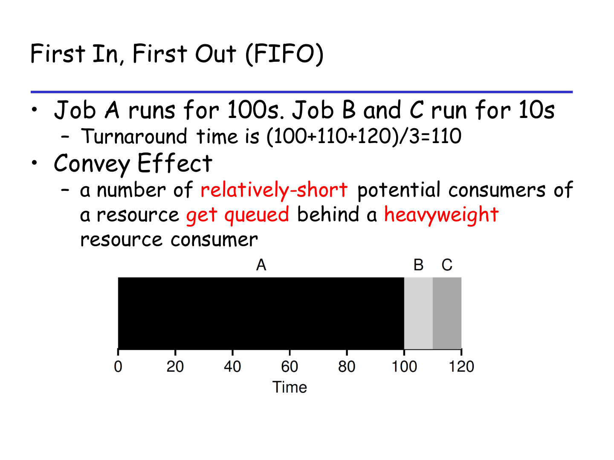
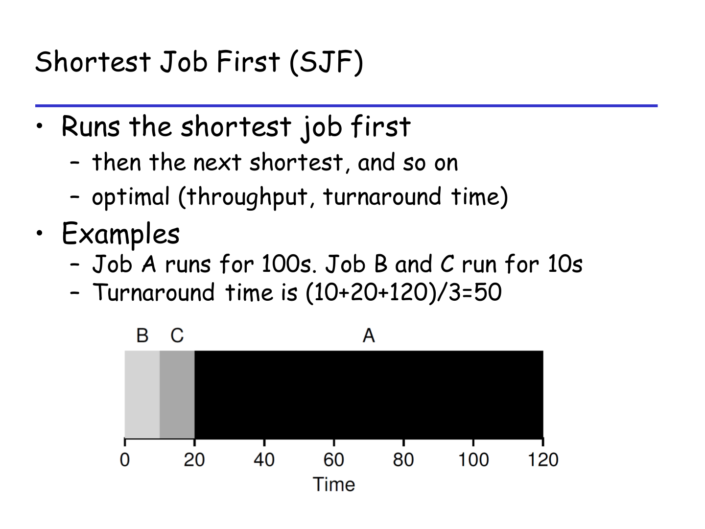
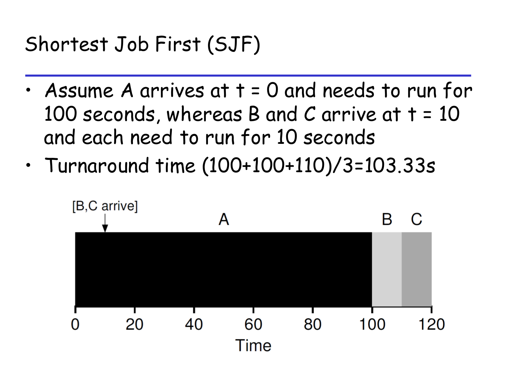
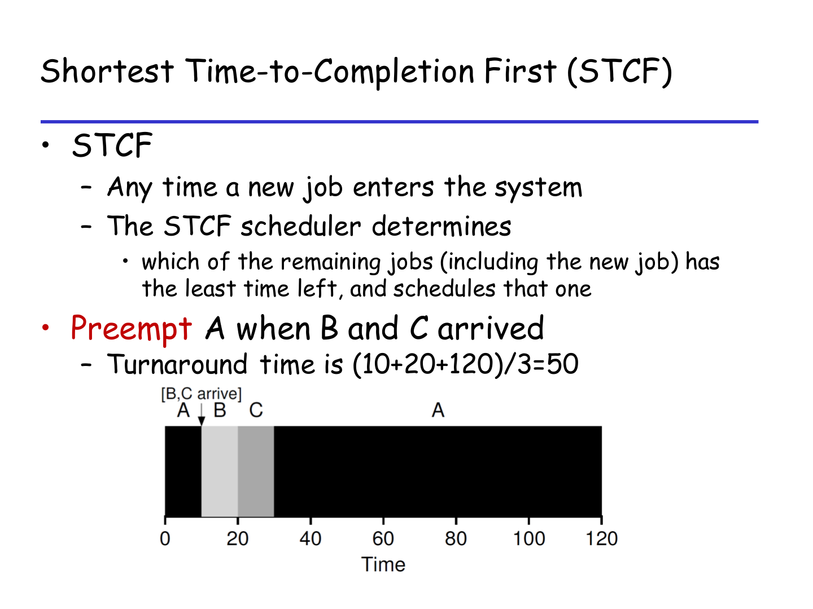
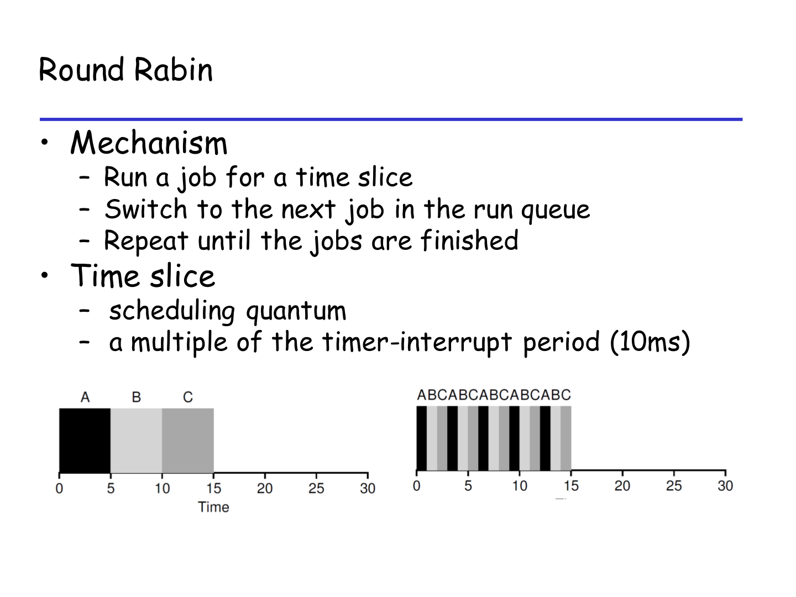

# 03 Schedule 开卷速查

## 一分钟速查

Schedule 题主要是手工 trace：给 job arrival / runtime / quantum / MLFQ 规则，让你写调度顺序，算 turnaround、response，再解释 convoy effect 或 starvation。

来源优先级：

- `EXE/EXE7.pdf`：Problem 3，Scheduling Policy Comparison。
- `EXE/EXE7-sol.pdf`：Problem 3 答案。
- `EXE/EXE7.pdf`：Problem 4，MLFQ Trace。
- `EXE/EXE7-sol.pdf`：Problem 4 答案。
- `courseware/2-13-sched.pdf`、`courseware/review.pdf`：FIFO、SJF、STCF、RR、MLFQ 规则。

注意：`EXE/EXE7.pdf` 的 Problem 1/2 是 signal 相关，复习课明确说 signal 期末不考；本章只看 Problem 3/4。

题型对应来源：

| 题型 | 主要来源 |
|---|---|
| FIFO / SJF / STCF / RR 时间线、平均 turnaround、平均 response、某时刻 CPU 运行哪个 job | `EXE/EXE7.pdf` Problem 3 |
| convoy effect 定性解释 | `EXE/EXE7.pdf` Problem 3 |
| MLFQ trace、completion/turnaround/response、starvation | `EXE/EXE7.pdf` Problem 4 |

核心句：

> Schedule 题本质是时间线模拟。先画每个 policy 的执行区间，再回头算指标，不要边想边口算。

## 必背指标

周转时间（turnaround time）：

```text
T_turnaround = T_completion - T_arrival
```

响应时间（response time）：

```text
T_response = T_first_run - T_arrival
```

每个 job 必记四个数：

| 字段 | 含义 |
|---|---|
| arrival time | 到达时间 |
| runtime / burst time | 总运行时间 |
| first run time | 第一次上 CPU 的时间 |
| completion time | 完成时间 |

平均值：

```text
avg turnaround = sum(turnaround) / job_count
avg response   = sum(response) / job_count
```

## 题型模板

### 1. FIFO / FCFS

来源：`EXE/EXE7.pdf` Problem 3。



规则：

- First In, First Out / First Come, First Served。
- 非抢占（non-preemptive）。
- 一个 job 开始后运行到完成。

步骤：

1. 按 arrival time 排 ready queue。
2. CPU 空闲时取队首。
3. 运行到完成。
4. 记录 first_run 和 completion。

典型现象：

> Convoy effect：长 job 排在前面，后面短 job 被迫等待，response/turnaround 被拉高。

### 2. SJF

来源：`EXE/EXE7.pdf` Problem 3。

<p>
  
  
</p>

左图是 A/B/C 同时到达，右图是 A 先到达。

规则：

- Shortest Job First。
- 非抢占。
- 每次 CPU 空闲时，在已经到达的 jobs 中选 runtime 最短的。

易错点：

- SJF 不会因为新来的短 job 打断当前 job。
- 如果长 job 已经开始，新来的短 job 只能等它完成。

### 3. STCF

来源：`EXE/EXE7.pdf` Problem 3。



规则：

- Shortest Time-to-Completion First。
- 抢占式 SJF。（ preempt 打断）
- 每次新 job 到达，都比较所有 ready jobs 的 remaining time。

步骤：

1. 在 arrival time 和 completion time 处重新决策。
2. 当前 job 如果不是 remaining time 最短，就被 preempt。
3. 时间线要写成多段，例如 `A 0-2, B 2-4, A 4-...`。

典型特点：

- 短 job 到来时可能 response time = 0。
- 长 job 可能被一直抢占，有 starvation 风险。

### 4. Round Robin

来源：`EXE/EXE7.pdf` Problem 3。



规则：

- 每个 job 最多运行一个 time quantum。
- 没完成就放到 ready queue 队尾。
- 提前完成就直接切下一个 job。

步骤：

1. 明确 quantum，例如 2 ms。
2. 维护 ready queue。
3. 每个时间片结束时处理新到达 jobs。
4. 记录 first_run / completion。

开卷提示：

> RR 题最容易错在 ready queue 顺序。不要跳步，必须逐段写。

### 5. MLFQ

来源：`EXE/EXE7.pdf` Problem 4。

常见规则：

1. 高优先级队列优先于低优先级队列。
2. 同优先级内按 RR。
3. 新 job 通常进入最高优先级。
4. 在某层用完 time allotment 后降级。
5. 定期 priority boost 防止 starvation（把所有 job 重新提到最高优先级）。

做题步骤：

1. 按题面写清楚每个 queue 的 quantum / allotment。
2. 新 job 进入最高队列。
3. 高优先级非空时，低优先级不运行。
4. 同级内按 RR。
5. 用完该层 allotment 才降级。
6. 有 priority boost 时，全体回最高队列。

Starvation 标准答法：

> 如果高优先级队列持续有短 job 到达，低优先级长 job 可能长期得不到 CPU。周期性 priority boost 可以缓解或避免 starvation。

## EXE7 Problem 3 表格题模板

题面常给：

```text
Policy | Avg turnaround | Avg response | CPU at t=6 | CPU at t=12
FIFO
SJF
STCF
RR
```

答题流程：

1. 分别画四条时间线。
2. 对每个 job 标出 `first_run` 和 `completion`。
3. 算每个 job 的 turnaround / response。
4. 算平均值。
5. 查 `t=6`、`t=12` 落在哪一段。

边界习惯：

```text
[start, end)
```

例如 `4-6` 通常不包含 `t=6`，`t=6` 已经进入下一段。除非题目另有说明。

## 考场检查清单

1. 先把所有 jobs 的 arrival/runtime 抄成表。
2. 每个 policy 单独画时间线。
3. FIFO/SJF 是非抢占，STCF/RR 是抢占。
4. SJF 只在 CPU 空闲时选；STCF 每次新 job 到达都可能重选。
5. RR 必须维护 ready queue。
6. MLFQ 必须看清题目自定义规则。
7. 算 response 时只看第一次运行，不是完成时间。
8. 解释 convoy/starvation 时要引用具体等待或优先级现象。

## 高频术语

- Scheduling policy：调度策略。
- Turnaround time：周转时间。
- Response time：响应时间。
- FIFO / FCFS：先来先服务。
- SJF: Shortest Job First，短作业优先。
- STCF: Shortest Time-to-Completion First，最短剩余完成时间优先。
- RR: Round Robin，时间片轮转。
- Time quantum / time slice：时间片。
- Preemption：抢占。
- Convoy effect：护航效应，长任务堵住短任务。
- MLFQ: Multi-Level Feedback Queue，多级反馈队列。
- Starvation：饥饿。
- Priority boost：优先级提升。
