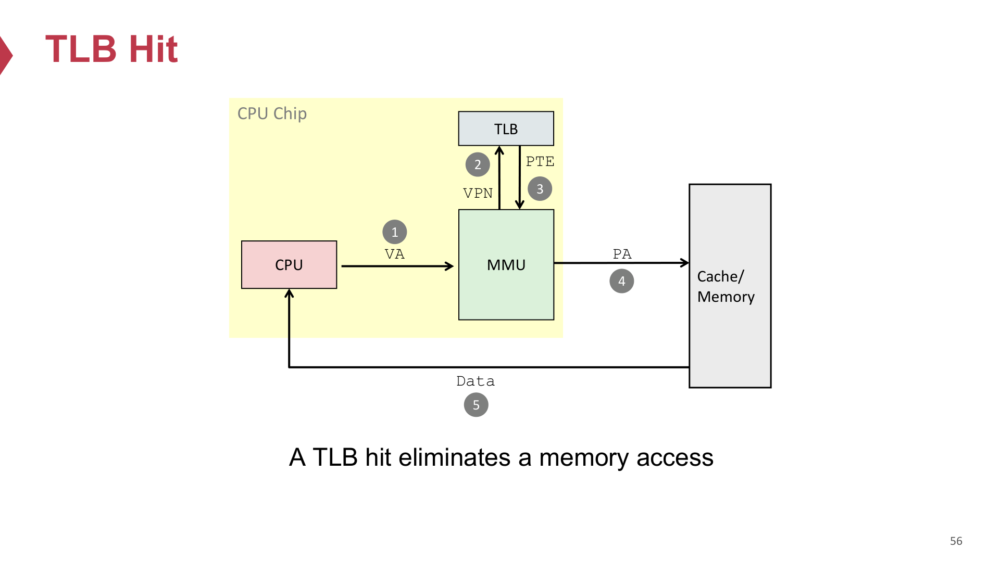
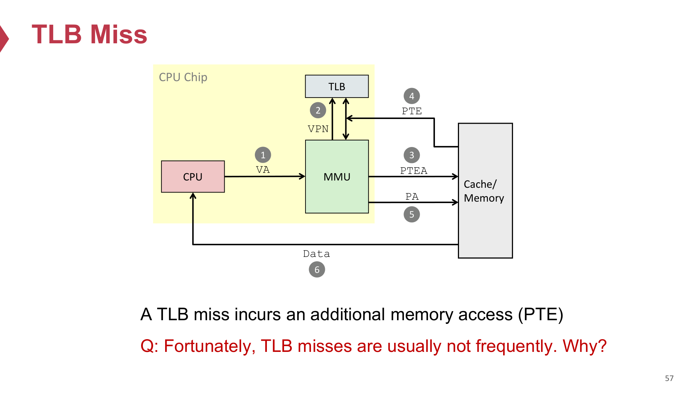
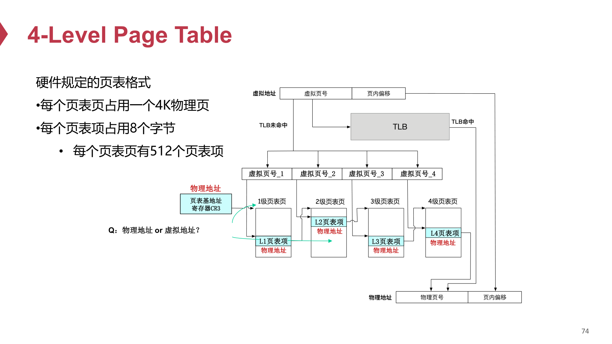
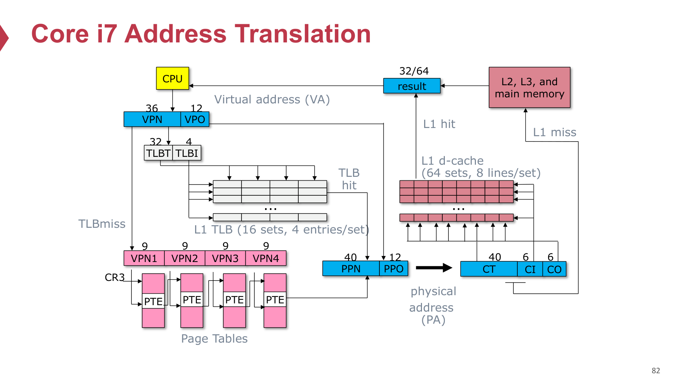

# 04 Virtual Memory 开卷速查

## 一分钟速查

VM 是这次复习的重点题。高频考点不是“背概念”，而是：位数计算、多级页表、huge pages、VIPT、`mmap`、page fault、swapping / page replacement、COW、clock algorithm，外加一个 allocator / buddy system 小题的可能性。

来源优先级：

- `QUIZ/ics2-quiz.pdf`：Problem 3，VM 主体真题。
- `QUIZ/ics2-quiz-2&3.pptx`：Problem 3 walkthrough。
- `courseware/2-17-vm_*.pdf`：VA/PA、page table、TLB、VIPT。
- `courseware/2-18-vm-part2_*.pdf`：`mmap`、COW、replacement、clock algorithm。
- `courseware/2-19-vm-part3_*.pdf`：allocator、buddy/slab。

复习课补充：

- QUIZ 已覆盖 bit 位数、多级页表、VIPT、`mmap`。
- 老师明确说：除了 QUIZ Problem 3，还要复习 swapping 等 QUIZ 没考到的 VM 知识点。
- 还要额外重视 `swapping`、`page replacement`、`clock algorithm` trace。
- allocator / buddy system 也可能单独出小题。

题型对应来源：

| 题型 | 主要来源 |
|---|---|
| VPO/PPO/VPN/PPN/entries per PT page/index bits/CI/CO/CT | `QUIZ/ics2-quiz.pdf` Problem 3.1 |
| 多级页表 page-table pages 数量、huge pages 节省内存 | `QUIZ/ics2-quiz.pdf` Problem 3.2 |
| VIPT 条件 `CI + CO <= VPO` | `QUIZ/ics2-quiz.pdf` Problem 3.3；`ics2-quiz-2&3.pptx` |
| `mmap` vs `read + write`、on-demand paging | `QUIZ/ics2-quiz.pdf` Problem 3.4 |
| page fault / TLB / COW / `fork` 机制 | `courseware/2-17-vm_*.pdf`、`2-18-vm-part2_*.pdf` |
| swapping / page replacement / dirty write-back | `courseware/2-18-vm-part2_*.pdf`；复习课点名 |
| clock algorithm trace | `courseware/2-18-vm-part2_*.pdf` |
| allocator / buddy system | `courseware/2-19-vm-part3_*.pdf` |

核心句：

> VM 题本质上是两件事：地址怎么切、页面怎么进出。前者是 VPN/VPO、PPN/PPO、页表、VIPT；后者是 page fault、demand paging、swapping、COW、replacement。

## 基本概念

- VA: Virtual Address，虚拟地址。
- PA: Physical Address，物理地址。
- Page：页，常见大小 4KB。
- VPN / VPO：virtual page number / virtual page offset。
- PPN / PPO：physical page number / physical page offset。
- PTE：page table entry。
- MMU：Memory Management Unit，负责地址翻译。
- TLB：地址翻译的 cache。

地址拆分：

```text
VA = VPN | VPO
PA = PPN | PPO
```

页大小是 `2^p` bytes 时：

```text
VPO bits = PPO bits = p
VPN bits = VA bits - p
PPN bits = PA bits - p
```

关键点：

> 地址翻译只改 page number，不改 page offset。VPO 和 PPO 相同。

## VM 完整链路

<p>
  
  
</p>

<p>
  
</p>

<p>
  
</p>

这是做 VM 题时脑子里要先跑一遍的主线：

```text
CPU 发出 VA
-> MMU 拆成 VPN + VPO
-> 先查 TLB
-> TLB hit：直接得到 PPN
-> TLB miss：用 PTBR 找当前进程页表，再用 VPN 查 PTE （PTEA = PTBR + VPN * sizeof(PTE)）
-> PTE valid=1：得到 PPN，并可把映射装入 TLB
-> PPN + VPO 拼成 PA
-> 用 PA 访问 cache / physical memory
-> PTE valid=0：触发 page fault exception，交给 OS 处理
```

要点：

- 程序和 CPU 指令里看到的是 virtual address。
- PTBR 指向当前进程的 page table；进程切换时会换 PTBR。
- TLB 是 PTE / 地址翻译结果的 cache，减少查页表的开销。
- page table 把 VPN 翻译成 PPN，同时记录 valid、protection、dirty、reference 等状态位。
- 地址翻译只替换 page number：`VPN -> PPN`，offset 保持不变：`VPO = PPO`。
- 如果 PTE valid=0，可能是合法页面不在内存，也可能是非法地址或权限错误。


## 必背公式

### 1. 位数

```text
page size = 2^p
VPO = PPO = p
VPN = VA bits - p
PPN = PA bits - p
```

### 2. 每页页表项个数

```text
entries per page-table page = page_table_page_size / PTE_size
index bits per level = log2(entries per page-table page)
```

### 3. Cache / VIPT

```text
CO = log2(line size)
CI = log2(number of sets)
CT = PA bits - CI - CO
VIPT feasibility: CI + CO <= VPO
```

## 题型模板

### 1. Bit-width fundamentals

来源：`QUIZ/ics2-quiz.pdf` Problem 3.1。

典型配置：

- VA = 48 bits
- PA = 52 bits
- page size = 4KB = `2^12`
- PTE = 8B
- L1 data cache = 64 sets × 8-way × 64B

计算：

```text
VPO / PPO = 12
VPN = 48 - 12 = 36
PPN = 52 - 12 = 40
entries per PT page = 4096 / 8 = 512
index bits per PT level = log2(512) = 9
CO = log2(64) = 6
CI = log2(64) = 6
CT = 52 - 6 - 6 = 40
```

开卷提示：这题基本就是代公式，不要紧张。

### 2. 多级页表占多少内存

来源：`QUIZ/ics2-quiz.pdf` Problem 3.2。

核心原则：

> Count page-table pages, not total mapped pages.

x86-64 四级页表拆分：

```text
L1 PML4: bits 47-39
L2 PDPT: bits 38-30
L3 PD:   bits 29-21
L4 PT:   bits 20-12
VPO:     bits 11-0
```

做题步骤：

1. 写 start VA 和 end VA。
2. 分别拆出 L1/L2/L3/L4 indices。
3. 看每一级有多少不同 index 被使用。
4. 每个被使用的下一级 table 需要一个 page-table page。
5. 总页表内存 = page-table pages 数 × 4KB。

QUIZ 典型结论：映射一个从 `0x0040_0000` 开始的 8MB 连续区间时，

- L1：1 page
- L2：1 page
- L3：1 page
- L4：4 pages
- 总计：`7 pages = 28KB`

易错点：

- 不要把“映射了多少虚拟页”直接当成“用了多少页表页”。
- 一个 L4 page-table page 可覆盖 512 个 4KB pages，也就是 2MB 范围。

### 3. Huge pages

来源：`QUIZ/ics2-quiz.pdf` Problem 3.2(b)。

2MB huge page 的关键：

- L3（PD）entry 设置 PS bit。
- 直接映射 2MB physical frame。
- 省掉下面的 L4 PT page。

同样 8MB 映射：

- L1：1 page
- L2：1 page
- L3：1 page
- L4：0 page
- 总计：`3 pages = 12KB`
- 比 regular pages 节省：`28 - 12 = 16KB`

一句话答法：

> Huge pages 不是消灭所有页表开销，而是 prune 掉 L4 level。

### 4. VIPT

来源：`QUIZ/ics2-quiz.pdf` Problem 3.3；`ics2-quiz-2&3.pptx`。

关键条件：

```text
CI + CO <= VPO
```

含义：

> cache index bits 和 cache offset bits 必须全部落在 page offset 内，因为 page offset 在 VA 和 PA 中相同。

例：32KB L1，64 sets，8-way，64B line，4KB page。

```text
CO = 6
CI = 6
VPO = 12
6 + 6 = 12 <= 12
```

所以 VIPT feasible。

64KB 两种设计：

- Design A: 128 sets × 8-way × 64B  
  `CI = 7, CO = 6, 7 + 6 = 13 > 12`  
  结论：VIPT breaks，需要最小 page size = `2^13 = 8KB`

- Design B: 64 sets × 16-way × 64B  
  `CI = 6, CO = 6, 6 + 6 = 12 <= 12`  
  结论：VIPT still works

易错点：

- 扩大 cache 不一定破坏 VIPT。
- 增大 sets 会增加 CI；增大 associativity 不增加 CI。

### 5. TLB / page hit / page fault

来源：`courseware/2-17-vm_*.pdf`。

Page hit 流程：

1. CPU 发出 VA。
2. MMU 通过 TLB/页表得到 PTE。
3. 若 valid=1，则得到 PA。
4. cache/memory 返回数据。

TLB hit：

- 省掉一次访问内存取 PTE 的开销。

TLB miss：

- 多一次访问页表的开销。

Page fault：

1. CPU 发 VA。
2. MMU 发现 PTE valid=0。
3. 触发 page fault exception。
4. OS 判断原因。
5. 如果合法但页面不在内存：page in / swap in。
6. 如果 victim dirty：先写回。
7. 更新 PTE。
8. 重新执行 faulting instruction。

常考三类原因：

- 物理内存不够，页面被 swap out。
- on-demand paging：例如 `mmap` 后第一次访问才加载。
- 非法地址或权限错误：segmentation fault。

### 6. Swapping / page replacement

来源：`courseware/2-18-vm-part2_*.pdf`；复习课明确点名 QUIZ 外补充。

Swapping 要解决的问题：

> 物理内存放不下所有 virtual pages，所以 OS 需要把一部分页临时放到 disk，需要时再换回 physical memory。

基本流程：

1. 进程访问某个 VA。
2. PTE 显示该 virtual page 合法，但不在 physical memory。
3. 触发 page fault。
4. OS 找一个空闲 physical frame。
5. 如果没有空闲 frame，就用 replacement policy 选 victim page。
6. 如果 victim 是 dirty page，先写回 disk；如果 clean，通常可以直接丢弃。
7. 从 disk 把需要的 page swap in 到 frame。
8. 更新 PTE / TLB，重新执行 faulting instruction。

关键区分：

- swap out：把内存中的页换到 disk，释放 physical frame。
- swap in：把 disk 上的页重新读回 physical memory。
- dirty page：被写过，swap out 前必须保存。
- clean page：没有被改过，通常可直接丢弃，之后再从原 backing store 读回。

常见问法：

- “为什么会 page fault？”  
  答：页面合法但不在内存，可能被 swap out，也可能是 demand paging 尚未加载。

- “为什么需要 replacement policy？”  
  答：因为 physical memory 有限，swap in 新页时可能必须踢出旧页。

- “为什么 replacement 常用 LRU 思想？”  
  答：利用 locality。最近用过的页更可能很快再用，久未访问的页更适合换出。

补充概念：

- Working set：进程近期活跃使用的页面集合。
- Thrashing：物理内存太小，系统频繁 swap in/out，真正计算时间很少，性能急剧下降。

一句话答法：

> Swapping 是 VM 把 physical memory 当作 disk 的 cache 来管理；page replacement 决定 cache 满时踢谁。

### 7. `mmap` 为什么快

来源：`QUIZ/ics2-quiz.pdf` Problem 3.4。

`read + write`：

```text
disk -> kernel page cache -> user buffer -> kernel output buffer
```

CPU copy 两次：

1. `read()`：kernel page cache -> user buffer
2. `write()`：user buffer -> kernel output buffer

`mmap + write`：

```text
disk -> kernel page cache = mapped region -> kernel output buffer
```

核心点：

- `mmap()` 不复制文件内容到 user buffer。
- 它安装 PTE，让用户虚拟地址直接映射 page cache 中的页。
- 所以 CPU copy 只剩一次 `write()`。

大文件只读 header 时：

- `read(fd, buf, 1GB)` 会把整个 1GB 读入并复制。
- `mmap` 是 lazy / demand paging，只触碰前 4KB 时通常只 fault in 一个页。

一句话答法：

> `mmap` wins by copy elimination and demand paging, not because it avoids all syscalls.

### 8. COW

来源：`courseware/2-18-vm-part2_*.pdf`。

Copy-on-Write：

- `fork` 后父子进程先共享相同物理页。
- PTE 标为只读/private COW。
- 任一进程写该页时触发 page fault。
- fault handler 分配新页、复制旧内容、更新写入进程的 PTE。

一句话：

> 只在“真正写”的那一页上复制，其余页继续共享。

### 9. Clock algorithm

来源：`courseware/2-18-vm-part2_*.pdf`；复习课点名。

Clock 是 LRU 的近似：

- 每页有 reference bit。
- 指针像钟表一样扫描。
- 遇到 `reference=1`：清零并跳过。
- 遇到 `reference=0`：选为 victim。

考试套路：

> 给访问序列和若干物理页框，让你按时间线一步步写当前内存里有哪些页、reference bit 状态、时针指向哪里。

做题时不要脑补优化，老老实实一轮一轮转。

和 swapping 的关系：

> Clock algorithm 是一种 page replacement policy。它决定物理页框满时哪个 page 被 swap out。

### 10. allocator / buddy system

来源：`courseware/2-19-vm-part3_*.pdf`；复习课点名。

Buddy system 关键思想：

- 物理内存按 2 的幂大小分层。
- 需要小块时，从更大块一路 split。
- 释放后若 buddy 空闲，可 merge 回更大块。

老师强调的 trade-off：

- 分配快慢
- fragmentation 大小

一句话：

> Buddy system 用较快的分配速度，换取可控而不至于太严重的 fragmentation。

## 考场检查清单

1. 先写 page size，立刻得到 `VPO=PPO`。
2. 位数题：先算 `VPN/PPN`，再算 `entries per PT page`。
3. 页表题：按“每一级多少 page-table pages”算。
4. huge page：看是否 prune 某一级。
5. VIPT：先算 `CI`、`CO`，再比 `CI + CO <= VPO`。
6. `mmap`：想的是“少一次 user-buffer copy + demand paging”。
7. page fault：判断是 swapped out、on-demand，还是非法访问。
8. swapping：先想 victim、dirty write-back、swap in、更新 PTE。
9. clock：一时刻一时刻写，不跳步。
10. allocator：优先记 buddy 的 split/merge 和 trade-off。

## 高频术语

- Virtual address (VA)：虚拟地址。
- Physical address (PA)：物理地址。
- VPN / VPO：虚拟页号 / 页内偏移。
- PPN / PPO：物理页号 / 页内偏移。
- Page table / PTE：页表 / 页表项。
- MMU：内存管理单元。
- TLB：地址翻译缓存。
- Page fault：缺页异常。
- Swapping：换入/换出。
- Swap in / swap out：从磁盘换入 / 换出到磁盘。
- Page replacement：页面替换。
- Dirty page：脏页，被写过、换出前要写回。
- Working set：工作集。
- Thrashing：频繁换页导致系统抖动。
- Demand paging：按需分页。
- Segmentation fault / SIGSEGV：段错误。
- Huge page：大页。
- VIPT: Virtually Indexed, Physically Tagged。
- `mmap`：内存映射。
- COW: Copy-on-Write，写时复制。
- Clock algorithm：时钟替换算法。
- Buddy system：伙伴系统。
