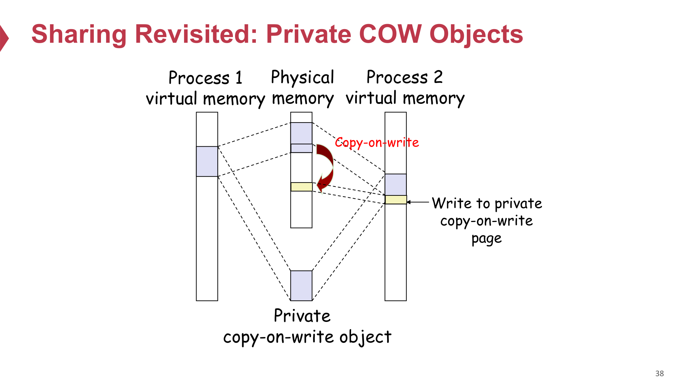
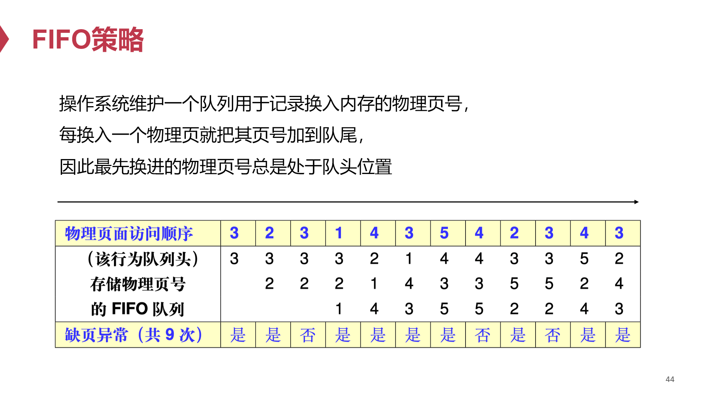
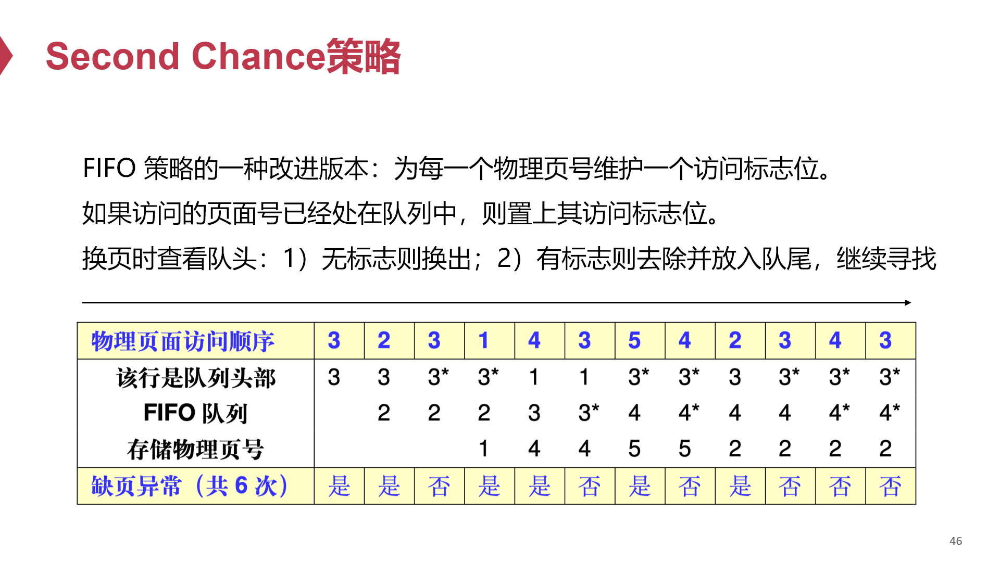
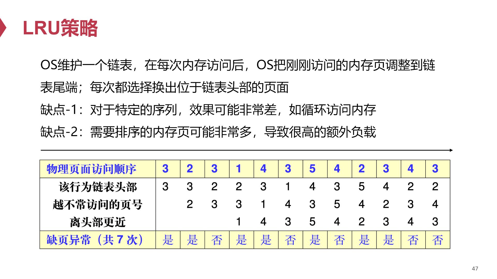
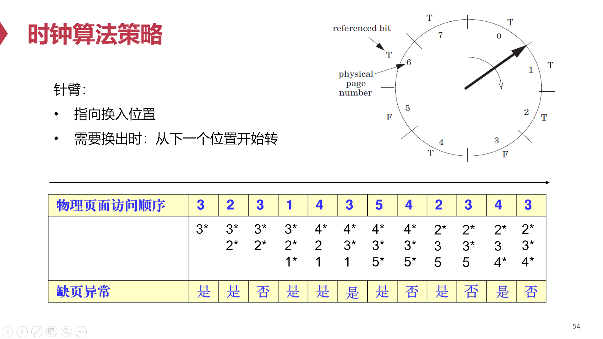
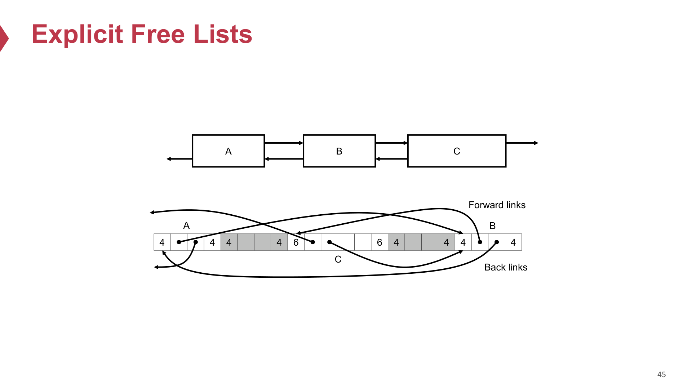

# 04 Virtual Memory 开卷速查

## 一分钟速查

VM 是这次复习的重点题。高频考点不是“背概念”，而是：位数计算、多级页表、huge pages、VIPT、`mmap`、page fault、swapping / page replacement、COW、clock algorithm，外加一个 allocator / buddy system 小题的可能性。

来源优先级：

- `QUIZ/ics2-quiz.pdf`：Problem 3，VM 主体真题。
- `QUIZ/ics2-quiz-2&3.pptx`：Problem 3 walkthrough。
- `courseware/2-17-vm_*.pdf`：VA/PA、page table、TLB、VIPT。
- `courseware/2-18-vm-part2_*.pdf`：`mmap`、COW、replacement、clock algorithm。
- `courseware/2-19-vm-part3_*.pdf`：allocator、buddy/slab。

复习课补充：

- QUIZ 已覆盖 bit 位数、多级页表、VIPT、`mmap`。
- 老师明确说：除了 QUIZ Problem 3，还要复习 swapping 等 QUIZ 没考到的 VM 知识点。
- 还要额外重视 `swapping`、`page replacement`、`clock algorithm` trace。
- allocator / buddy system 也可能单独出小题。

题型对应来源：

| 题型 | 主要来源 |
|---|---|
| VPO/PPO/VPN/PPN/entries per PT page/index bits/CI/CO/CT | `QUIZ/ics2-quiz.pdf` Problem 3.1 |
| 多级页表 page-table pages 数量、huge pages 节省内存 | `QUIZ/ics2-quiz.pdf` Problem 3.2 |
| VIPT 条件 `CI + CO <= VPO` | `QUIZ/ics2-quiz.pdf` Problem 3.3；`ics2-quiz-2&3.pptx` |
| `mmap` vs `read + write`、on-demand paging | `QUIZ/ics2-quiz.pdf` Problem 3.4 |
| page fault / TLB / COW / `fork` 机制 | `courseware/2-17-vm_*.pdf`、`2-18-vm-part2_*.pdf` |
| swapping / page replacement / dirty write-back | `courseware/2-18-vm-part2_*.pdf`；复习课点名 |
| clock algorithm trace | `courseware/2-18-vm-part2_*.pdf` |
| allocator / buddy system | `courseware/2-19-vm-part3_*.pdf` |

核心句：

> VM 题本质上是两件事：地址怎么切、页面怎么进出。前者是 VPN/VPO、PPN/PPO、页表、VIPT；后者是 page fault、demand paging、swapping、COW、replacement。

## 基本概念

- VA: Virtual Address，虚拟地址。
- PA: Physical Address，物理地址。
- Page：页，常见大小 4KB。
- VPN / VPO：virtual page number / virtual page offset。
- PPN / PPO：physical page number / physical page offset。
- PTE：page table entry，存 PPN + 一堆状态位。
- MMU：Memory Management Unit，负责地址翻译。
- TLB：地址翻译的 cache。

地址拆分：

```text
VA = VPN | VPO
PA = PPN | PPO
```

页大小是 `2^p` bytes 时：

```text
VPO bits = PPO bits = p
VPN bits = VA bits - p
PPN bits = PA bits - p
```

关键点：

> 地址翻译只改 page number，不改 page offset。VPO 和 PPO 相同。

## VM 完整链路

<p>
  
  
</p>

<p>
  
</p>

<p>
  
</p>

这是做 VM 题时脑子里要先跑一遍的主线：

```text
CPU 发出 VA
-> MMU 拆成 VPN + VPO
-> 先查 TLB
-> TLB hit：直接得到 PPN
-> TLB miss：用 PTBR 找当前进程页表，再用 VPN 查 PTE （PTEA = PTBR + VPN * sizeof(PTE)）
-> PTE valid=1：得到 PPN，并可把映射装入 TLB
-> PPN + VPO 拼成 PA
-> 用 PA 访问 cache / physical memory
-> PTE valid=0：触发 page fault exception，交给 OS 处理
```

要点：

- 程序和 CPU 指令里看到的是 virtual address。
- PTBR 指向当前进程的 page table；进程切换时会换 PTBR。
- TLB 是 PTE / 地址翻译结果的 cache，减少查页表的开销。
- page table 把 VPN 翻译成 PPN，同时记录 valid、protection、dirty、reference 等状态位。
- 地址翻译只替换 page number：`VPN -> PPN`，offset 保持不变：`VPO = PPO`。
- 如果 PTE valid=0，可能是合法页面不在内存，也可能是非法地址或权限错误。


## 必背公式

### 1. 位数

```text
page size = 2^p
VPO = PPO = p
VPN = VA bits - p
PPN = PA bits - p
```

### 2. 每页页表项个数

```text
entries per page-table page = page_table_page_size / PTE_size
index bits per level = log2(entries per page-table page)
```

### 3. Cache / VIPT

```text
CO = log2(line size)
CI = log2(number of sets)
CT = PA bits - CI - CO
VIPT feasibility: CI + CO <= VPO
```

## 题型模板

### 1. Bit-width fundamentals

来源：`QUIZ/ics2-quiz.pdf` Problem 3.1。

典型配置：

- VA = 48 bits
- PA = 52 bits
- page size = 4KB = `2^12`
- PTE = 8B
- L1 data cache = 64 sets × 8-way × 64B

计算：

```text
VPO / PPO = 12
VPN = 48 - 12 = 36
PPN = 52 - 12 = 40
entries per PT page = 4096 / 8 = 512
index bits per PT level = log2(512) = 9
CO = log2(64) = 6
CI = log2(64) = 6
CT = 52 - 6 - 6 = 40
```

开卷提示：这题基本就是代公式，不要紧张。

### 2. 多级页表占多少内存

来源：`QUIZ/ics2-quiz.pdf` Problem 3.2。

核心原则：

> Count page-table pages, not total mapped pages.

x86-64 四级页表拆分：

```text
L1 PML4: bits 47-39
L2 PDPT: bits 38-30
L3 PD:   bits 29-21
L4 PT:   bits 20-12
VPO:     bits 11-0
```

做题步骤：

1. 写 start VA 和 end VA。
2. 分别拆出 L1/L2/L3/L4 indices。
3. 看每一级有多少不同 index 被使用。
4. 每个被使用的下一级 table 需要一个 page-table page。
5. 总页表内存 = page-table pages 数 × 4KB。

QUIZ 典型结论：映射一个从 `0x0040_0000` 开始的 8MB 连续区间时，

- L1：1 page
- L2：1 page
- L3：1 page
- L4：4 pages
- 总计：`7 pages = 28KB`

易错点：

- 不要把“映射了多少虚拟页”直接当成“用了多少页表页”。
- 一个 L4 page-table page 可覆盖 512 个 4KB pages，也就是 2MB 范围。

### 3. Huge pages

来源：`QUIZ/ics2-quiz.pdf` Problem 3.2(b)。

2MB huge page 的关键：

- L3（PD）entry 设置 PS bit。
- 直接映射 2MB physical frame。
- 省掉下面的 L4 PT page。

同样 8MB 映射：

- L1：1 page
- L2：1 page
- L3：1 page
- L4：0 page
- 总计：`3 pages = 12KB`
- 比 regular pages 节省：`28 - 12 = 16KB`

一句话答法：

> Huge pages 不是消灭所有页表开销，而是 prune 掉 L4 level。

### 4. VIPT

来源：`QUIZ/ics2-quiz.pdf` Problem 3.3；`ics2-quiz-2&3.pptx`。

关键条件：

```text
CI + CO <= VPO
```

含义：

> cache index bits 和 cache offset bits 必须全部落在 page offset 内，因为 page offset 在 VA 和 PA 中相同。

例：32KB L1，64 sets，8-way，64B line，4KB page。

```text
CO = 6
CI = 6
VPO = 12
6 + 6 = 12 <= 12
```

所以 VIPT feasible。

64KB 两种设计：

- Design A: 128 sets × 8-way × 64B  
  `CI = 7, CO = 6, 7 + 6 = 13 > 12`  
  结论：VIPT breaks，需要最小 page size = `2^13 = 8KB`

- Design B: 64 sets × 16-way × 64B  
  `CI = 6, CO = 6, 6 + 6 = 12 <= 12`  
  结论：VIPT still works

易错点：

- 扩大 cache 不一定破坏 VIPT。
- 增大 sets 会增加 CI；增大 associativity 不增加 CI。

### 5. TLB / page hit / page fault

来源：`courseware/2-17-vm_*.pdf`。

Page hit 流程：

1. CPU 发出 VA。
2. MMU 通过 TLB/页表得到 PTE。
3. 若 valid=1，则得到 PA。
4. cache/memory 返回数据。

TLB hit：

- 省掉一次访问内存取 PTE 的开销。

TLB miss：

- 多一次访问页表的开销。

Page fault：

1. CPU 发 VA。
2. MMU 发现 PTE valid=0。
3. 触发 page fault exception。
4. OS 判断原因。
5. 如果合法但页面不在内存：page in / swap in。
6. 如果 victim dirty：先写回。
7. 更新 PTE。
8. 重新执行 faulting instruction。

常考三类原因：

- 物理内存不够，页面被 swap out。
- on-demand paging：例如 `mmap` 后第一次访问才加载。
- 非法地址或权限错误：segmentation fault。

### 6. Swapping / page replacement

来源：`courseware/2-18-vm-part2_*.pdf`；复习课明确点名 QUIZ 外补充。

Swapping 要解决的问题：

> 物理内存放不下所有 virtual pages，所以 OS 需要把一部分页临时放到 disk，需要时再换回 physical memory。

基本流程：

1. 进程访问某个 VA。
2. PTE 显示该 virtual page 合法，但不在 physical memory。
3. 触发 page fault。
4. OS 找一个空闲 physical frame（用来承载一个 virtual page 的固定大小物理内存块）。
5. 如果没有空闲 frame，就用 replacement policy 选 victim page。
6. 如果 victim 是 dirty page，先写回 disk；如果 clean，通常可以直接丢弃。
7. 从 disk 把需要的 page swap in 到 frame。
8. 更新 PTE / TLB，重新执行 faulting instruction。

关键区分：

- swap out：把内存中的页换到 disk，释放 physical frame。
- swap in：把 disk 上的页重新读回 physical memory。
- dirty page：被写过，swap out 前必须保存。
- clean page：没有被改过，通常可直接丢弃，之后再从原 backing store 读回。

常见问法：

- “为什么会 page fault？”  
  答：页面合法但不在内存，可能被 swap out，也可能是 demand paging 尚未加载。

- “为什么需要 replacement policy？”  
  答：因为 physical memory 有限，swap in 新页时可能必须踢出旧页。

- “为什么 replacement 常用 LRU 思想？”  
  答：利用 locality。最近用过的页更可能很快再用，久未访问的页更适合换出。

补充概念：

- Working set：进程近期活跃使用的页面集合。
- Thrashing：物理内存太小，系统频繁 swap in/out，真正计算时间很少，性能急剧下降。

一句话答法：

> Swapping 是 VM 把 physical memory 当作 disk 的 cache 来管理；page replacement 决定 cache 满时踢谁。

### 7. `mmap` 为什么快

来源：`QUIZ/ics2-quiz.pdf` Problem 3.4。

- mmap 先只建立“用户 VA 区间 ↔ 文件 offset”的关系，不读完整文件。（先给进程分配/保留一段合法用户虚拟地址范围，但不一定立刻分配物理内存或读文件内容。）首次访问某页时，PTE 不存在触发 page fault；OS 检查合法后，把对应文件页读入 page cache，更新 PTE，让该 VA 指向该物理页，再重执行指令。只访问的页才会被调入。

`read + write`：

```text
disk -> kernel page cache -> user buffer -> kernel output buffer
```

CPU copy 两次：

1. `read()`：kernel page cache -> user buffer
2. `write()`：user buffer -> kernel output buffer

`mmap + write`：

```text
disk -> kernel page cache = mapped region -> kernel output buffer
```

核心点：

- `mmap()` 不复制文件内容到 user buffer。
- 它安装 PTE，让用户虚拟地址直接映射 page cache 中的页。
- 所以 CPU copy 只剩一次 `write()`。

大文件只读 header 时：

- `read(fd, buf, 1GB)` 会把整个 1GB 读入并复制。
- `mmap` 是 lazy / demand paging，只触碰前 4KB 时通常只 fault in 一个页。（只访问的 pages 才会 fault in）

一句话答法：

> `mmap` wins by copy elimination and demand paging, not because it avoids all syscalls.

### 8. COW

来源：`courseware/2-18-vm-part2_*.pdf`。

<p>
  
</p>

Copy-on-Write：

- `fork` 后父子进程先共享相同物理页。
- PTE 标为只读/private COW。
- 任一进程写该页时触发 page fault。
- fault handler 分配新页、复制旧内容、更新写入进程的 PTE。

一句话：

> 只在“真正写”的那一页上复制，其余页继续共享。

### 9. Clock algorithm

来源：`courseware/2-18-vm-part2_*.pdf`；复习课点名。

<p>
  
  
</p>

<p>
  
  
</p>

Clock 是 LRU 的近似：

- 每页有 reference bit。
- 指针像钟表一样扫描。
- 遇到 `reference=1`：清零并跳过。遇到 `reference=0`：选为 victim。

考试套路：

> 给访问序列和若干物理页框，让你按时间线一步步写当前内存里有哪些页、reference bit 状态、时针指向哪里。

课件第 54 页这版指针规则：

- `*` 表示 `reference bit = 1`。
- 命中：只把该页 reference bit 设为 1，指针保持在上一位置不动。
- 缺页且有空位：插入空位，新页 reference bit 设为 1，指针停在插入位置。
- 缺页且内存已满：从指针的下一个位置开始扫。
  - 遇到 `reference=1`：清成 0，继续往后扫。
  - 遇到 `reference=0`：替换它，新页 reference bit 设为 1，指针停在新插入位置。

关键句：

> 指针停在上一次换入位置；下一次需要换出时，从它的下一个位置开始扫。

和 swapping 的关系：

> Clock algorithm 是一种 page replacement policy。它决定物理页框满时哪个 page 被 swap out。

### 10. Allocator / buddy / slab

来源：`courseware/2-19-vm-part3_*.pdf`；复习课点名。

这部分如果出题，大概率是简答或小计算，不是让你手写完整 `malloc`。

核心问题：

> allocator 把 heap / physical memory 管成一堆 blocks，在速度和 memory utilization 之间折中。

基本接口：

- `malloc(size)`：返回至少 `size` bytes 的 block，通常要满足 alignment。
- `free(p)`：把 `p` 指向的 block 还给 allocator。
- `sbrk(+n)`：向 OS 要更多 heap 空间，移动 `brk`。

两个性能目标：

- throughput：单位时间完成多少次 `malloc/free`。
- memory utilization：有效 payload 占 heap 的比例，常见形式是 `U = P / H`。

Fragmentation：

- Internal fragmentation：block 内部浪费。原因包括 header/footer、alignment padding、分配策略不 split。
- External fragmentation：总 free memory 够，但没有一个连续 free block 足够大。

Block metadata：

- `free(p)` 只拿到 payload 指针，但能释放整块，是因为 block 前面有 header。
- header 通常记录 `size + allocated bit`。
- 因为 block size 按 8-byte alignment，低位可用来存 allocated/free bit。

Implicit free list：

> Heap 里的 blocks 连续排放，不存显式 next 指针；allocator 靠 header 里的 size 跳到下一个 block。

- allocator 按 heap 中 block 的物理顺序扫描。
- first fit：找第一个够大的 free block，快但可能在前面留下小碎片。
- next fit：从上次搜索结束处继续找，可能更快，但 fragmentation 可能更差。
- best fit：找最接近需求大小的 block，通常利用率好一些，但搜索更慢。

Splitting / coalescing：

> Splitting 是把大空闲块切小；coalescing 是把相邻空闲块合大，减少碎片。

- splitting：free block 比请求大时，切成 allocated block + 剩余 free block。
- coalescing：`free` 后把相邻 free blocks 合并，避免 false fragmentation。
- boundary tag / footer：在 free block 尾部也存 `size + allocated bit`，方便向前找 previous block，做到双向 coalescing。

Explicit free list：

> 只把 free blocks 串成链表，分配时跳过 allocated blocks，搜索更快。

<p>
  
</p>

- 只把 free blocks 串成链表，分配时不用扫 allocated blocks。
- 指针存在 free block 的 payload 区域里。
- free list 顺序不一定等于内存地址顺序。
- LIFO 插入简单快；address-ordered 插入可能 fragmentation 更好但要搜索。

Segregated free list：

> 按大小分类维护多条 free lists，先去合适 size class 里找空闲块。

- 按 size class 维护多条 free lists。
- 分配时先找对应大小类，不够再找更大的类。
- 比全 heap 搜索快，也更接近 best fit。

Buddy system：

> Buddy system 是 2 的幂大小块管理：分配时 split，释放时和空闲 buddy merge。

- Buddy system 是 size class 为 2 的幂、并且支持 buddy split/merge 的 segregated free list 特例。
- 物理内存按 2 的幂大小分层。
- 申请 `m` pages 时，找满足 `2^(n-1) < m <= 2^n` 的 `2^n` pages block。
- 如果只有更大的 block，就不断 split 成两个 buddy。
- 释放时，如果 buddy 也空闲，就 merge 回更大的 block。
- buddy 地址只差某一位：block size 是 `2^k` 时，buddy 起始地址可理解为翻转第 `k` 位。

例：从 32KB 空闲块中分配 5KB。

```text
5KB 向上取整为 8KB
[32KB free]
-> split -> [16KB free][16KB free]
-> split one 16KB -> [8KB used][8KB free][16KB free]
```

释放这个 8KB 时：

```text
[8KB free][8KB free][16KB free]
-> merge -> [16KB free][16KB free]
-> merge -> [32KB free]
```

Slab allocator：

> Slab allocator 是固定尺寸对象池：从 buddy/OS 拿大块内存切成同样大小的 slots，分配时拿一个，释放时还回去。

- 先从 OS/buddy system 拿连续 pages 组成 slab。
- 每个 slab 切成固定大小 slots，用于频繁分配同类小对象。
- 分配：从对应 size/object pool 的 free list 取一个 slot。
- 释放：把 slot 放回 free list。
- 优点是快，且能减少特定对象大小的 internal fragmentation。

常见 trade-off：

- 快：简单策略、固定大小池、segregated/slab。
- 省：best fit、coalescing、address-ordered，但维护成本更高。
- buddy 快且易 merge，但按 2 的幂向上取整会有 internal fragmentation。

一句话：

> Allocator 题先想 block metadata，再想 free block 怎么找，最后想 split/coalesce 如何影响 fragmentation。

## 考场检查清单

1. 先写 page size，立刻得到 `VPO=PPO`。
2. 位数题：先算 `VPN/PPN`，再算 `entries per PT page`。
3. 页表题：按“每一级多少 page-table pages”算。
4. huge page：看是否 prune 某一级。
5. VIPT：先算 `CI`、`CO`，再比 `CI + CO <= VPO`。
6. `mmap`：想的是“少一次 user-buffer copy + demand paging”。
7. page fault：判断是 swapped out、on-demand，还是非法访问。
8. swapping：先想 victim、dirty write-back、swap in、更新 PTE。
9. clock：一时刻一时刻写，不跳步。
10. allocator：先分 internal/external fragmentation，再看 header、split/coalesce、buddy/slab。

## 高频术语

- Virtual address (VA)：虚拟地址。
- Physical address (PA)：物理地址。
- VPN / VPO：虚拟页号 / 页内偏移。
- PPN / PPO：物理页号 / 页内偏移。
- Page table / PTE：页表 / 页表项。
- MMU：内存管理单元。
- TLB：地址翻译缓存。
- Page fault：缺页异常。
- Swapping：换入/换出。
- Swap in / swap out：从磁盘换入 / 换出到磁盘。
- Page replacement：页面替换。
- Dirty page：脏页，被写过、换出前要写回。
- Working set：工作集。
- Thrashing：频繁换页导致系统抖动。
- Demand paging：按需分页。
- Segmentation fault / SIGSEGV：段错误。
- Huge page：大页。
- VIPT: Virtually Indexed, Physically Tagged。
- `mmap`：内存映射。
- COW: Copy-on-Write，写时复制。
- Clock algorithm：时钟替换算法。
- Internal fragmentation：块内部浪费。
- External fragmentation：总空闲够但没有连续大块。
- Header / footer：记录 block size、allocated bit 等 metadata。
- Coalescing：合并相邻 free blocks。
- Buddy system：伙伴系统。
- Slab allocator：固定大小对象池分配器。
